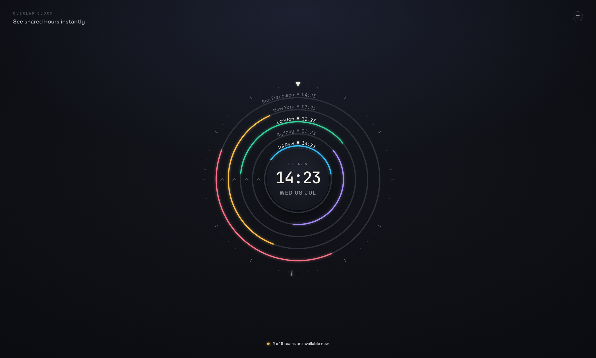

# overlap

[](https://overlap-clock.vercel.app)

A radial multi-timezone clock. Five cities are drawn as concentric rings around a
central local time; each ring shows a colored arc for that city's working hours with
a dot at its current moment. A shared **NOW** axis points straight up, so overlapping
arcs near the top mean everyone is currently in working hours — answering
_"See shared hours instantly"_ at a glance.

Built from a Claude Design reference (`World Clock v4`) — React + Vite + TypeScript,
all graphics rendered as SVG from `Intl.DateTimeFormat`, no timezone/date libraries.



## Features

- Concentric per-city rings with working-hours arcs (soft glow + crisp pass)
- Live now-dots (white with a pulsing halo when the city is in working hours, dimmed otherwise)
- NOW strike line, graduated bezel, and a needle that sweeps one revolution per minute
- Direction chevrons emphasizing the clockwise sweep
- Central glass disc with the local city's time and date
- DST-correct via IANA timezone ids; respects `prefers-reduced-motion`
- Schedule a meeting: drag the clock face (or use arrow keys) to preview a different
  time across every ring, then create the event on your Google Calendar

## Development

```bash
npm install
npm run dev      # start the dev server (http://localhost:5173)
npm run build    # typecheck + production build
npm test         # geometry + timezone unit tests (Vitest)
npm run lint     # oxlint
```

### Environment variables

Scheduling meetings is gated behind a Google OAuth Client ID (client-side only, no
backend). Copy `.env.example` to `.env.local` and fill in `VITE_GOOGLE_CLIENT_ID` to
enable it; without it, the Schedule panel shows a note instead of the form.

## Structure

- `src/clock/geometry.ts` — ring/arc/tick/chevron math on a 1000×1000 viewBox
- `src/clock/cityTime.ts` — timezone-aware time + working-hours helpers
- `src/clock/WorldClock.tsx` — the radial clock component (props-driven; `now` supplied by the parent)
- `src/clock/defaultCities.ts` — default home + world cities and working hours
- `src/hooks/useNow.ts` — shared 1s tick

## License

Released under the [MIT License](./LICENSE).
