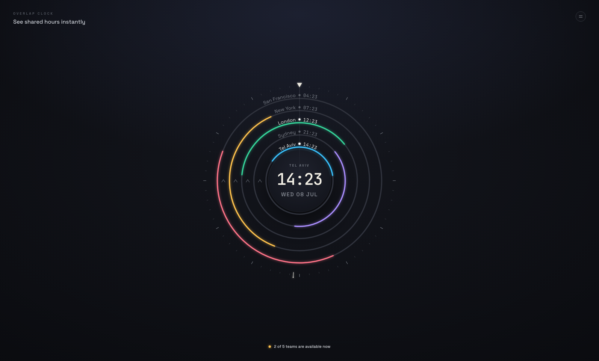

# overlap

> World Clock at a Glance

[](https://overlapclock.com)

A free, open-source, backend-free world clock for scheduling across timezones.
Add any cities as configurable concentric rings around your local time; each ring
shows a colored arc for that location's working hours with a dot at its current
moment, so overlapping arcs mean everyone is currently available — answering
_"World Clock at a Glance"_. Share the exact view via a link (no
signup, no account), or schedule a meeting straight to Google Calendar.

Built from a Claude Design reference (`World Clock v4`) — React + Vite + TypeScript,
all graphics rendered as SVG from `Intl.DateTimeFormat`, no timezone/date libraries.



## Features

- Fully configurable locations: add or remove any city, reorder rings, set which
  city is "home", and customize each location's color and working hours
- Concentric per-city rings with working-hours arcs (soft glow + crisp pass)
- Live now-dots (white with a pulsing halo when the city is in working hours, dimmed otherwise)
- Share button copies a link that reproduces your exact configuration for anyone
  who opens it — the whole config lives in the URL hash, no account or database
- Schedule a meeting: drag the clock face (or use arrow keys) to preview a different
  time across every ring, then create the event on your Google Calendar
- Graduated bezel, a NOW marker fixed at 12 o'clock, and a needle that sweeps one
  revolution per minute
- Direction chevrons emphasizing the clockwise sweep
- Central glass disc with the local city's time and date
- DST-correct via IANA timezone ids; respects `prefers-reduced-motion`
- Responsive layout for desktop and mobile (portrait and landscape)

## Development

```bash
npm install
npm run dev      # start the dev server (http://localhost:5173)
npm run build    # typecheck + production build
npm test         # geometry + timezone unit tests (Vitest)
npm run lint     # oxlint
```

### Environment variables

Scheduling meetings is gated behind a Google OAuth Client ID (client-side only, no
backend). Copy `.env.example` to `.env.local` and fill in `VITE_GOOGLE_CLIENT_ID` to
enable it; without it, the Schedule panel shows a note instead of the form.

## Short links (optional backend)

Hash links (`#c=…`) always work and need no setup. Setting `VITE_OVERLAP_API_URL`
additionally turns on path-based short links (`overlapclock.com/abc123`) backed by
[`overlap-api`](../overlap-api): the Share button uses a short link when one is
ready and falls back to the hash link otherwise (API down, unreachable, or the
variable unset), and a short-link-shaped path is resolved against `GET
/links/:id` on load.

**Local setup:**

1. In `../overlap-api`: start MongoDB, `cp .env.example .env` (make sure
   `FRONTEND_ORIGIN` includes `http://localhost:5173`), then `npm run dev`.
2. In this repo: copy `.env.example` to `.env.local` and set
   `VITE_OVERLAP_API_URL=http://localhost:3000`, then `npm run dev`.

### Enabling short links in production

`VITE_*` values are baked in at build time, so changing the Vercel environment
variable does nothing until the next build. Complete this checklist, in order,
before setting `VITE_OVERLAP_API_URL` in Vercel's **Production** environment:

1. overlap-api's `FRONTEND_ORIGIN` lists `https://overlapclock.com` **first**
   (order matters — `slack.routes.ts` redirects to the first entry after Slack
   OAuth), plus `https://www.overlapclock.com` if that host serves the app
   instead of redirecting.
2. This PR's updated `privacy.html` is live.
3. Set `VITE_OVERLAP_API_URL` in Vercel Production and **redeploy** — then, on
   `https://overlapclock.com` with DevTools open: **Share** — open the menu,
   click Share, and confirm the result is `https://overlapclock.com/<id>`, not
   a `#c=` link; **Open** — open that link in a private window and confirm the
   sender's cities appear. Confirm there's no CORS error in either check. A
   `#c=` link from Share with a `short link create failed: network` error
   logged almost always means `FRONTEND_ORIGIN` is wrong.

**Rollback warning:** once short links have been handed out, don't unset
`VITE_OVERLAP_API_URL` or take `overlap-api` down — every recipient would
silently see their own clock instead of the sender's. Fix forward (keep `GET
/links/:id` reachable) instead of rolling back.

## Chrome extension

A Manifest V3 toolbar popup renders the same `WorldClock` at 380×600, with a
Share action and an "Open in Overlap" handoff to the full web app — see
`tech-design.md` for what it deliberately leaves out (Google Calendar
scheduling, time-scrubbing, Find overlap) and why.

```bash
npm run build:extension   # typecheck + production build into dist-extension/
```

Then load `dist-extension/` unpacked at `chrome://extensions` (enable
Developer mode, "Load unpacked").

## Structure

- `src/clock/geometry.ts` — ring/arc/tick/chevron math on a 1000×1000 viewBox
- `src/clock/cityTime.ts` — timezone-aware time + working-hours helpers
- `src/clock/WorldClock.tsx` — the radial clock component (props-driven; `now` supplied by the parent)
- `src/clock/defaultCities.ts` — default home + world cities and working hours
- `src/hooks/useNow.ts` — shared 1s tick

## License

Released under the [MIT License](./LICENSE).

## Privacy

See the [privacy policy](https://overlapclock.com/privacy.html) for what data the
app collects (a short-link snapshot of your cities and working hours, if you use
that feature — see above), and how the Google Calendar scope is used.
